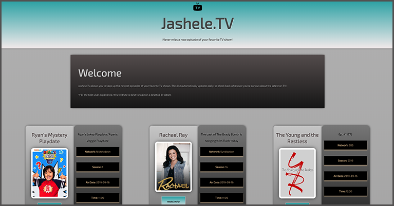

# TV Guide
This React app allows users to see the latest episodes on television. The data is generated from a live 3rd party API and is automatically updated each day. Each request gets `image`, `overview`, `country`, `language`, and `vote average`.

# Tech Stack
- React

# Preview

# Network
- [DevJashele.Tech](https://devjashele.tech/ "Personal Site")
- [LinkedIn](https://www.linkedin.com/in/jashelet/ "LinkedIn")
- [Twitter](https://twitter.com/jasheloper "Twitter")
